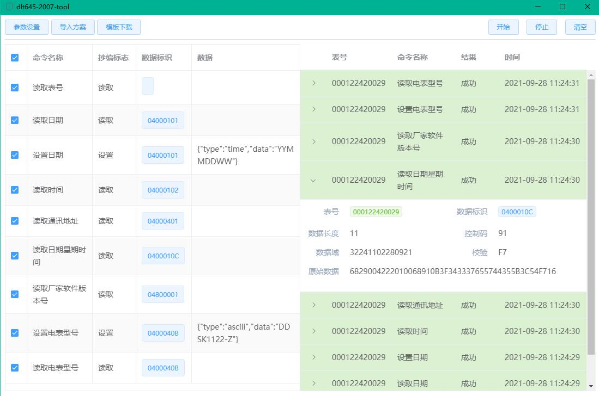
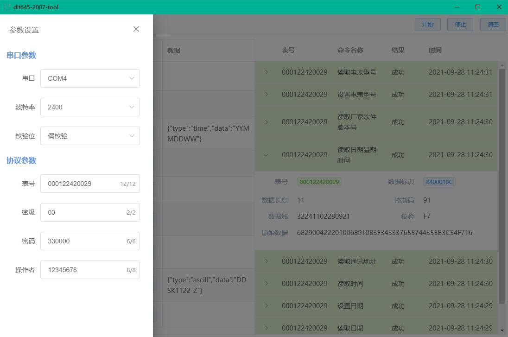

# dlt645-2007-tool

> 一个简易的DLT645-2007协议通讯工具


### 说明

一个基于 [Electron](https://github.com/electron/electron) + [Vue](https://github.com/vuejs/vue)(基于[electron-vue](https://github.com/SimulatedGREG/electron-vue)) + [element-ui](https://github.com/ElemeFE/element) + [serialport](https://github.com/serialport/node-serialport) 在Windows平台下开发的DLT645-2007协议通讯工具。

所用技术栈：

- [Electron](https://github.com/electron/electron) 12.1.1
- [Vue](https://github.com/vuejs/vue) 2.6.14
- [electron-vue](https://github.com/SimulatedGREG/electron-vue)
- [element-ui](https://github.com/ElemeFE/element) 2.15.6,
- [serialport](https://github.com/serialport/node-serialport) 9.2.1


### Windows下环境搭建
- node: 14.17.5
- npm: 6.14.14
- npm config set registry https://registry.npm.taobao.org/
- npm config set ELECTRON_MIRROR http://npm.taobao.org/mirrors/electron/
- Python: 3.x
- 安装[Visual Studio 2017 15.7.2 或更高版本](https://visualstudio.microsoft.com/zh-hans/vs/) 或安装[ Visual Studio Build Tools](https://visualstudio.microsoft.com/thank-you-downloading-visual-studio/?sku=BuildTools) 并执行 npm config set msvs_version 2017
- 为 Electron 安装并重新编译Node原生模块: npm install --save-dev electron-rebuild;  若windows下遇到问题，尝试执行 .\node_modules\.bin\electron-rebuild.cmd
- npm install -g node-gyp
### 构建

```

# 安装依赖
npm install

# 开发环境
npm run dev

# 生产环境
npm run build


```

### 界面

## 界面一

<div align="center">
	
</div>

## 界面二

<div align="center">
	
</div>